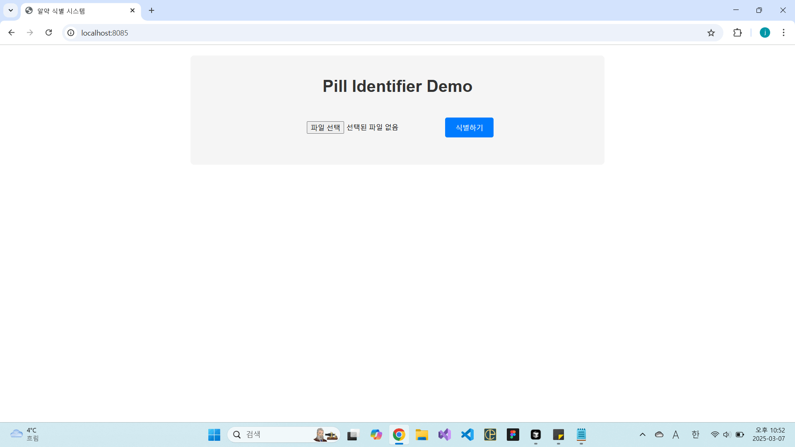

# 알약 식별 시스템 (Pill Identifier)

## Preview




## Overview

이 프로젝트는 알약 이미지를 분석하여 해당 약품을 식별하는 웹 애플리케이션입니다. Gemini AI를 활용하여 알약의 모양, 색상, 각인을 인식하고, 이 정보를 바탕으로 건강정보 포털에서 약품 정보를 검색합니다.

## Purpose

알약의 사진만으로 약품 정보를 쉽게 검색할 수 있는 서비스를 구상하였습니다. 최신 AI 기술을 활용하여 알약의 외형적 특징(모양, 색상, 각인)을 정확히 인식하고, 이를 바탕으로 약품 데이터베이스에서 정확한 정보를 검색합니다.

이 시스템은 노인분들뿐만 아니라, 처방전을 분실했거나 약의 정보를 잊어버린 모든 사용자들에게 유용합니다. 간단한 사진 촬영만으로 약의 이름, 효능, 부작용 등 중요한 정보를 즉시 확인할 수 있어, 의약품 오남용 방지와 정확한 의료 정보 전달에 기여합니다.

## Functionalities

- **직관적인 사용자 인터페이스**: 
  - 사용자 친화적인 웹 인터페이스로 누구나 쉽게 사용할 수 있습니다.
  - 모바일 환경에서도 최적화된 반응형 디자인을 제공합니다.

- **이미지 업로드 및 미리보기**: 
  - 사용자가 알약 이미지를 쉽게 업로드할 수 있습니다.
  - 업로드 전 이미지 미리보기 기능으로 적절한 이미지인지 확인할 수 있습니다.
  - 다양한 이미지 형식(JPG, PNG, 등)을 지원합니다.

- **고급 AI 이미지 분석**: 
  - Google의 Gemini AI를 활용하여 알약의 물리적 특성을 정확히 분석합니다.
  - 알약의 모양(원형, 타원형, 사각형 등)을 자동으로 인식합니다.
  - 알약의 색상을 16가지 카테고리로 분류하여 정확히 식별합니다.
  - 알약에 새겨진 각인(문자, 숫자, 로고 등)을 텍스트로 변환합니다.
  - 이미지 품질이 낮거나 특징이 불분명한 경우에도 최대한 정보를 추출합니다.

- **정확한 약품 검색**: 
  - 인식된 특징을 바탕으로 건강정보 포털의 약품 데이터베이스를 검색합니다.
  - 여러 검색 조건을 조합하여 정확도 높은 결과를 제공합니다.
  - 부분적으로 일치하는 약품도 검색 결과에 포함시켜 선택의 폭을 넓힙니다.

- **상세한 결과 표시**: 
  - 검색된 약품 목록을 사용자 친화적인 방식으로 표시합니다.
  - 각 약품의 이미지, 이름, 제조사, 성분 등 상세 정보를 제공합니다.
  - 알약의 인식된 특징(모양, 색상, 각인)을 결과와 함께 표시하여 비교할 수 있습니다.
  - 테이블 형식의 정돈된 레이아웃으로 정보를 쉽게 확인할 수 있습니다.

- **실시간 처리**: 
  - 이미지 업로드부터 결과 표시까지 전 과정이 실시간으로 처리됩니다.
  - 처리 중 로딩 애니메이션으로 사용자에게 진행 상황을 알립니다.
  - 오류 발생 시 사용자 친화적인 메시지로 문제를 안내합니다.

- **확장성**: 
  - 모듈화된 코드 구조로 새로운 기능을 쉽게 추가할 수 있습니다.
  - 다양한 약품 데이터베이스와 연동 가능한 유연한 설계를 갖추고 있습니다.
  - 향후 다국어 지원 및 추가 약품 정보 제공 기능을 확장할 수 있습니다.

## How to Run

### 필요 조건
- Python 3.8 이상
- Chrome 웹 브라우저
- Gemini API 키

### 설치 방법

1. 저장소 클론
   ```bash
   git clone https://github.com/yourusername/pill-identifier.git
   cd pill-identifier
   ```

2. 필요한 패키지 설치
   ```bash
   pip install -r requirements.txt
   ```

3. `.env` 파일 생성 및 API 키 설정
   ```
   GEMINI_API_KEY=your_gemini_api_key_here
   ```

4. 애플리케이션 실행
   ```bash
   python app.py
   ```

5. 웹 브라우저에서 접속
   ```
   http://localhost:8085
   ```

## 기술 스택

- **백엔드**: Flask, Python
- **프론트엔드**: HTML, CSS, JavaScript
- **AI/ML**: Google Gemini API
- **웹 스크래핑**: Selenium
- **서버**: Waitress


